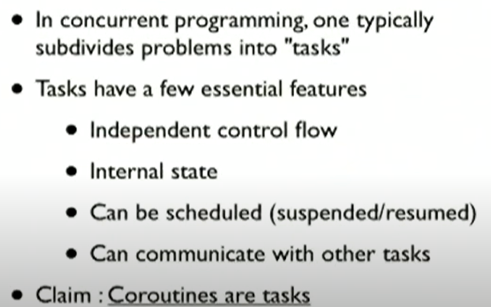

-
- # CODE and Video
	- http://www.dabeaz.com/coroutines/
	- https://youtu.be/Z_OAlIhXziw
-
	-
- ## Code Maintained Here
	-
## Coroutine
 Function that have multiple entry and exit points and that can be suspended and resumes at certain points.
 Used to provide simpler alternatives to threading. Since even threading is useless for cpu-bound task. So, using any of those won't be a problem.
	- ### [8:42] Introduction to Generators and Coroutines
	- Uses :
		- Create pipeilnes : Unix Pipe : `ls -l | find ./ -type f -name "*.txt"` >> Used to find all `.txt` files in current directory
		- Example : `simple_pipeline_with_generator.py`
- ### [20:00] Coroutines
  
  Generators produce data while iteration. Coroutines consume the data in iteration. 
  A general rule is to avoid having generators and coroutines in same function like 
  
  ```
  def countdown(n):
    '''
    A countdown generator whose start point can be changed by sending values  
  
    '''
    while n >= 0:
        new_start_point = (yield n)
        if new_start_point == 4:
            n = new_start_point
        else:
            n -= 1
  
  c = countdown(5)
  c.next()
  c.next()
  c.send(3)
  c.next()
  ```
  
  
  ```(python)
  # Exampe of an coroutine where we send stuffs
  def grep(pattern):
    print(f'Looking for the pattern - {pattern}')
    while True:
        line = (yield)
        if pattern in line:
            print(line)
  
  g = grep('python')
  g.next() ## This is essential to take program until the point of first yield
  # g.next() ## This will give error is `line` will be None
  # Instead we do this
  
  g.send('hii') ## This will populate value of `line` as `hii`. But since pattern is not found, nothing is printed and program loops back to line 20.
  g.send('python is a great language' ) ## This will print the value sent, and program loops back and suspends at line 20 again. 
  
  
  ## To get rid of overhead of doing next the first time, we decorate your coroutine. 
  def coroutine(func):
    def start(*args, **kwargs):
        gen = func(*args, **kwargs)
        next(gen)
        return gen
    return start
  
  @coroutine
  def grep(pattern):
    print(f'Looking for the pattern - {pattern}')
    while True:
        line = (yield)
        if pattern in line:
            print(line)
  
  ## Now, you can just do 
  g = grep('python')
  g.send('this line as python. so it should be printed')
  ```
-
- ### [34:05] Coroutines, Pipelines and DataFlow
  
  
  Like generators where we can setup pipeline to pull data, coroutines can be stacked to send data through a pipeline.
  
  
  [51:00] Coroutines Interlude
  
  Powerful data routing. Creating individual components. And stacking them in pipes.
  
  David does the `simple_pipeline_with_generator.py` version. But using coroutines.
  
  In generator stack, last generator asks for value from secondlast one. Until we reach the first generator.
  In coroutine stack, At first a `source` produces data which is sent down top down.
-
- ### [52:45] Objects vs Coroutines
  ```(python)
  class GrepHandler:
  '''
  An OO version for setting up pipelines like our coroutine.
  '''
  def __init__(pattern, target):
    self.pattern = pattern
    self.target = target
  def send(self, line):
    if self.pattern in line:
        self.target.send(line)
  ```
	- Basically, more syntax. And coroutines perform 30 percent better.
	  Not the reason to support coroutine. But sometimes it could be simpler this way.
- ### [55:00] Coroutines and event dispatching
	- Using coroutines with code that does event driven stuff. like xml sax module
- ### [1:!5:10] From Data Processing to Concurrent Programming
- ### [1:30:10] Break and QA
-
- ### [1:34:29] Coroutines as "tasks"
	- Beazley's Definition of a task
		- Task could be a separate thread, process ...
		- 
		- ```
		  ## Coroutine itself is a task 
		  ## Create a Task class as a  Wrapper to run a coroutine.
		  ## i.e rather than using coroutine object directly, use it through the `Task` interface
		  class Task:
		  	taskid = 0
		      def __init__(self, target):
		      	Task.taskid += 1
		          self.tid = Task.taskid
		          self.target = target # coroutine to be executed
		          self.sendval = None
		      # Run the task until it hits the next yield statement.
		      def run(self):
		      	return self.target.send(self.sendval)
		          
		  ## Scheduler
		  from queue import Queue
		  class Scheduler:
		  	def __init__(self):
		      	self.ready_queue = Queue()
		          self.taskmap = {}
		      
		      def new(self, target):
		      	newtask = Task(target)
		          self.taskmap[newtask.tid] = newtask
		          self.schedule(newtask)
		          return newtask.tid
		      
		      def schedule(self, task):
		      	self.ready_queue.put(task)
		          
		      def mainloop(self):
		      	while self.taskmap
		          	task = self.ready_queue.get()
		              result task.run()
		              self.schedule(task)
		  
		  ## Dummy working
		  def foo():
		  	while True:
		      	print('I am foo')
		          
		   def bar():
		  	while True:
		      	print('I am bar')
		  ```
	- ### [1:38:29] Crash course on working of an Operating system
		- Imagine a single CPU. basically, it context-switches and make it seem like it's running 10 programs simultaneously
		- It's job of an Operating system to context switch between tasks. Conondrum is, OS itself is a set of instruction. So, when OS code is running, another program cannot run. and vice versa.
		- There's a concept of trap. As a external program runs, during the point of [[system call]]] , execution flows back to os for a while. example : `read`.
	- ### [2:16:00] Building unix-like New Task creation, Killing SystemCalls
	- ### [2:19:00] Waiting for Tasks
		- Notes Maintained [Here](https://github.com/robinnarsinghranabhat/Python_Concurrency_Projects/blob/master/concurrency_snippets/curious_case_on_coroutines_and_concurrency/coroutine_os_03.py)
    
	- ### [2:25:00] Now Let's Build a Concurrent Web Server
		- Built a concurrent webserver using coroutines and select.
		- Idea is, only after socket is available to read or write (check by polling with select), execute commands like `socket.send`, `socket.accept` e.t.c. Othewise keep on Yielding inside the `handle_client` coroutine before steps like above.